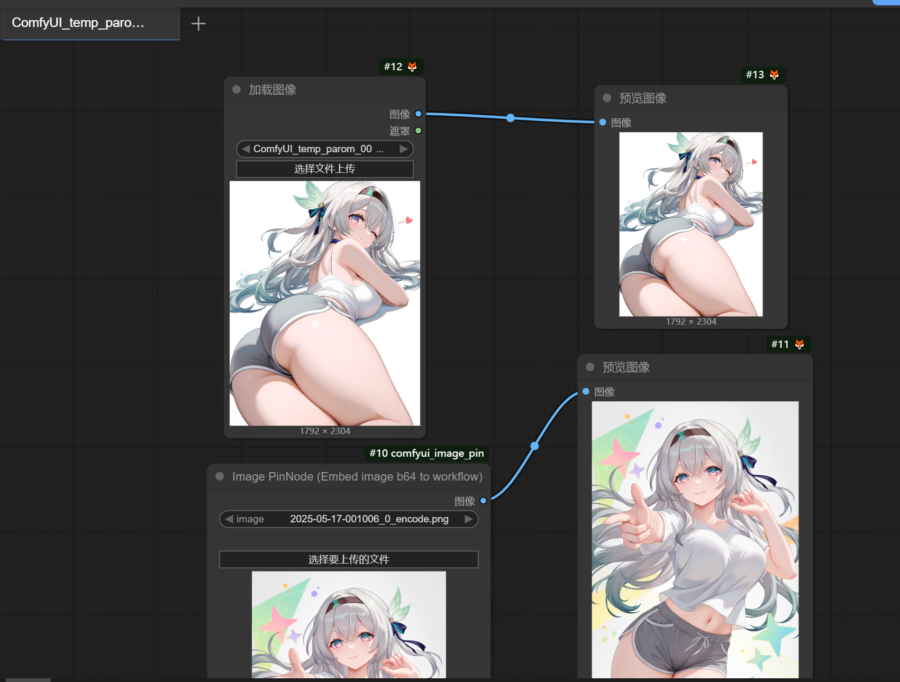

# ComfyUI Image Pin

### 简介

ComfyUI Image Pin 是一个 ComfyUI 的插件，允许您在 ComfyUI 工作流中“钉住”图像，并转换为Base64字符串嵌入到工作流中。

### 功能



#### 原理

原生节点不会嵌入到工作流中，而是保存在ComfyUI根目录的input文件夹中，因此你导出的JSON不会带有任何图片

| 对比 | 原生 Load Image | ImagePin |
| --- | --- | --- |
| 存储位置 | Comfy 根目录 input 文件夹 | 工作流JSON文件 |
| 保存方式 | 原文件 | Base64字符串 |
| 导出JSON | 不会带有图片 | 带有图片 |
| 导入JSON | 不会带有图片 | 带有图片 |
| 工作流大小 | 较小 | 较大 |

#### 快速尝试

拖拽此图片到你的ComfyUI，你会丢失原生LoadImage节点的图片，但保留ImagePin节点的图片。


#### 建议用法

- 嵌入图片到工作流，生成的图片的metadata也具有该图片
- 方便分享图片
- 建立提示词画廊，给画师串添加图片预览
- 等你探索

### 安装

1. 导航到您的 ComfyUI 安装目录下的 `custom_nodes` 文件夹。
2. 克隆此仓库：
   ```bash
   git clone https://github.com/CheNing233/ComfyUI_Image_Pin.git
   ```
3. 重启 ComfyUI。

### 使用方法

搜索 `ImagePin` 节点